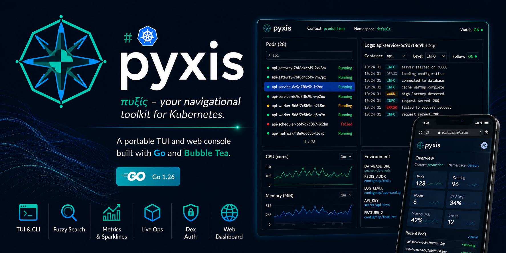

# ⎈ Pyxis

<p align="center">
  
</p>

**Pyxis** (πυξίς) — from Greek for a mariner's compass box — your navigational toolkit for Kubernetes. A portable TUI and web console built with Go and [Bubble Tea](https://github.com/charmbracelet/bubbletea).


[](https://github.com/zrougamed/pyxis/actions/workflows/ci.yml)
[](https://github.com/zrougamed/pyxis/releases)

> **License note:** Apache License 2.0 **with Commons Clause** — free to use, modify, and share; selling Pyxis (or a product whose value derives substantially from it) is not permitted. See [`LICENSE`](./LICENSE) and [`CONTRIBUTING.md`](./CONTRIBUTING.md).

## Features

- **Fuzzy search pods** — type part of a pod name and instantly filter
- **Live pod logs** — follow logs, pick containers, filter by level
- **Container images** — filter by Running / Pending / Failed / Succeeded
- **Environment variables** — inspect env vars with secret/configmap source tracking
- **Live ops** — delete pods, restart/scale workloads, exec, port-forward
- **Broader resources** — Jobs, CronJobs, Ingresses, PVCs, HPAs, CRDs, Helm releases
- **Context switching** — switch kubeconfig contexts without leaving the TUI
- **Namespace switching** — change namespace on the fly
- **Deployments, Services, Nodes, Events, ConfigMaps, Secrets** — all at your fingertips
- **Metrics gauges & sparklines** — metrics-server CPU/memory on pods/nodes
- **Copy to clipboard** — press `c` to copy any output (uses OS clipboard when available, internal buffer as fallback)
- **Fully portable** — single static binary, no OS dependencies required
- **Non-interactive CLI mode** — `pyxis pods`, `pyxis images`, `pyxis env <pod>`, etc.
- **Responsive web dashboard** — React UI for laptop/mobile (`--no-auth` for local use)
- **Dex protection** — optional Dex OIDC login flow to protect the web app and JSON API

## Installation

### From source (requires Go 1.26.5+)

```bash
go install github.com/zrougamed/pyxis/cmd@latest
```

### Prebuilt binaries

Download the latest release assets from [GitHub Releases](https://github.com/zrougamed/pyxis/releases) (linux / darwin / windows, amd64 & arm64).

### Build locally

```bash
git clone https://github.com/zrougamed/pyxis.git
cd pyxis
make build
./bin/pyxis
```

### Cross-compile

```bash
make cross-build
# Produces: bin/pyxis-{linux,darwin,windows}-{amd64,arm64}
```

## Usage

### Interactive TUI (default)

```bash
# Launch with default kubeconfig and context
pyxis

# Specify context and namespace
pyxis --context production --namespace my-app

# Use a custom kubeconfig
pyxis --kubeconfig /path/to/config
```

### Non-interactive CLI

```bash
# List all pods
pyxis pods -n default

# List container images
pyxis images -n production

# Get env vars for a specific pod
pyxis env my-pod-abc123 -n default

# List available contexts
pyxis contexts

# Version info
pyxis version
```

### Responsive web app and API

```bash
# Local unauthenticated access (laptop/dev)
pyxis web --no-auth

# Signed cookie session without Dex
pyxis web --cookie-secret change-me

# Protect the app with Dex OIDC
pyxis web \
  --cookie-secret change-me \
  --base-url https://pyxis.example.com \
  --dex-issuer https://dex.example.com \
  --dex-client-id pyxis \
  --dex-client-secret super-secret
```

Once started, open the web app in a laptop browser or mobile browser at `http://localhost:8080`.

### Web API endpoints

- `GET /api/health` — liveness probe
- `GET /api/me` — current user (local anonymous when `--no-auth`)
- `GET /api/summary` — current Kubernetes context and server version
- `GET /api/namespaces` — available namespaces
- `GET /api/pods?namespace=<ns>&filter=<all|running|not-running|pending|failed|succeeded>` — pod cards for the selected view
- `GET /api/pod-logs?...&container=&follow=&tail=` — pod logs (JSON snapshot or streamed text when follow=true)
- `GET /api/pod-containers?namespace=&pod=` — container names for a pod
- `POST /api/actions` — delete / restart / scale / exec / portforward

### Docker Compose

#### Full stack: Dex + pyxis web in Compose

```bash
# Build and run Dex plus pyxis web
docker compose up --build
```

This mode starts:

- `pyxis` on `http://localhost:8080`
- `dex` on `http://localhost:5556/dex`

The Compose stack mounts `${HOME}/.kube` read-only into the `pyxis` container, so the web app can talk to your cluster using your local kubeconfig. The default demo login is `admin@example.com` with password `password`.

If you need a different browser-visible Dex URL than the internal Docker network address, set `PYXIS_DEX_PUBLIC_ISSUER` and the stack will keep using the internal Dex service for token exchange while redirecting the browser to the public Dex address.

#### Dex only: use when running `pyxis web` locally

```bash
# Start only Dex in Docker
docker compose -f docker-compose.dex.yml up

# Then run pyxis locally against that Dex instance
pyxis web \
  --cookie-secret change-me \
  --base-url http://localhost:8080 \
  --dex-issuer http://localhost:5556/dex \
  --dex-client-id pyxis \
  --dex-client-secret pyxis-secret
```

The Dex-only Compose file uses a localhost issuer so a locally-running `pyxis web` process can complete discovery, login, token exchange, and `/userinfo` calls without Docker-network address translation.

## Keyboard Shortcuts

| Key | Action |
|-----|--------|
| `↑/k` `↓/j` | Navigate up/down |
| `Enter` | Select item |
| `/` | Start fuzzy search |
| `Esc` | Cancel search / go back |
| `c` / `C` | Copy item / env value / YAML |
| `y` | Fetch YAML for selection |
| `Y` / `A` / `a` | Lint / dry-run / apply YAML |
| `d` | Delete (with confirm) |
| `R` | Restart workload (with confirm) |
| `+` / `-` | Scale workload (with confirm) |
| `p` | Port-forward (prompt for `local:remote`) |
| `x` | Interactive shell (`kubectl exec -it`) |
| `w` | Watch mode (auto-refresh) |
| `L` | Cycle log level filter |
| `f` | Cycle pod filter (All → Running → …) |
| `r` | Refresh current view |
| `q` | Back to menu / quit |
| `Ctrl+C` | Quit |

CLI deep-links: `pyxis overview`, `pyxis logs [pattern]`, `pyxis pods --tui [pattern]`.

## Architecture

```
pyxis/
├── cmd/                    # CLI entry point (cobra commands)
│   └── main.go
├── internal/
│   ├── k8s/                # Kubernetes client (client-go wrapper)
│   │   ├── client.go
│   │   └── client_test.go
│   ├── webapp/             # Embedded React UI + JSON API + Dex auth
│   │   ├── server.go
│   │   ├── server_test.go
│   │   └── static/
│   ├── tui/                # Bubble Tea TUI
│   │   ├── model.go        # Elm-architecture model + update
│   │   ├── view.go         # Rendering
│   │   ├── model_test.go
│   │   └── styles/         # Lipgloss theme
│   │       └── styles.go
│   └── clipboard/          # Portable clipboard (no OS deps)
│       └── clipboard.go
├── pkg/
│   └── fuzzy/              # Fuzzy matching library
│       ├── fuzzy.go
│       └── fuzzy_test.go
├── deploy/
│   └── dex/               # Dex configs for Docker Compose modes
├── Dockerfile
├── docker-compose.yml     # Full stack: pyxis web + Dex
├── docker-compose.dex.yml # Dex only for local `pyxis web`
├── Makefile
├── go.mod
└── README.md
```

## Maintaining Kubernetes Compatibility

The project uses the official `k8s.io/client-go` library, which follows Kubernetes release versioning.

### Updating to the latest Kubernetes API

```bash
make update-k8s   # Updates client-go, api, apimachinery to latest
make test          # Verify everything still works
```

### Version compatibility matrix

| Pyxis | client-go | Kubernetes |
|-------|-----------|------------|
| main  | v0.36.x   | 1.36.x     |

The `client-go` library maintains a [compatibility policy](https://github.com/kubernetes/client-go#compatibility-matrix): each client-go version supports ±1 Kubernetes minor version. To support a new Kubernetes release, bump the `k8s.io/*` dependencies in `go.mod`.

### API deprecation handling

When Kubernetes deprecates APIs (e.g., `extensions/v1beta1` → `apps/v1`), you only need to update the `k8s.io/*` dependencies. The typed client automatically uses the correct API versions.

## Design Decisions

- **Bubble Tea + Lipgloss**: Elm-architecture TUI with styled output — no curses dependency
- **client-go (not shelling out to kubectl)**: Direct API access, typed responses, no kubectl binary needed
- **Cobra subcommands**: Both interactive and non-interactive modes
- **Internal clipboard fallback**: Works even without `xclip`/`pbcopy`
- **CGO_ENABLED=0**: Fully static binary, portable across Linux/macOS/Windows
- **Fuzzy matching**: Custom implementation (no CGO dependency like `fzf`)

## Testing

```bash
make test            # Run all tests
make test-coverage   # Generate coverage report
make lint            # Run golangci-lint
make run-web         # Run the embedded React web app locally
make compose-up      # Run Dex + pyxis web in Docker Compose
make compose-dex     # Run only Dex in Docker Compose
```

Tests use `k8s.io/client-go/kubernetes/fake` for Kubernetes API mocking — no cluster needed.

## Contributing

See [`CONTRIBUTING.md`](./CONTRIBUTING.md). Security reports: [`SECURITY.md`](./SECURITY.md).

## License

Copyright 2024–2026 Mohamed Zrouga.

Licensed under the **Apache License, Version 2.0, with Commons Clause**. You may use, modify, and redistribute Pyxis under Apache 2.0 terms, except that you may **not Sell** the software (including hosting or support offerings whose value derives substantially from Pyxis). Full text: [`LICENSE`](./LICENSE) · [`NOTICE`](./NOTICE).
